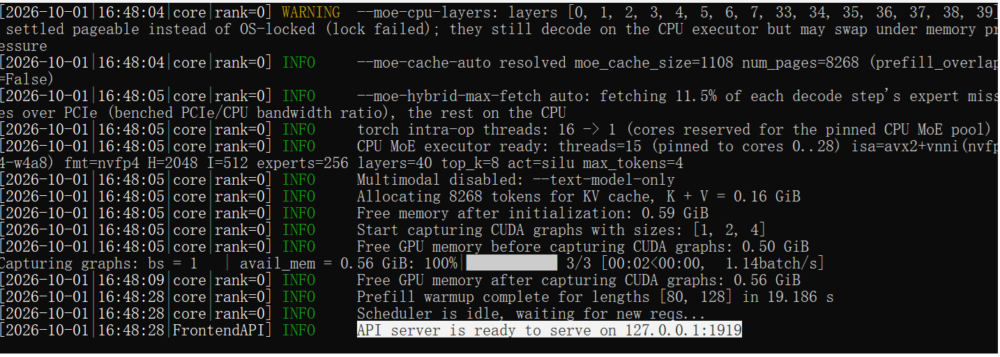
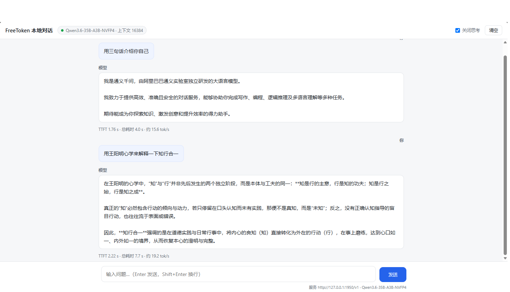

# FreeToken on 8GB —— 消费级显卡部署 35B MoE 的完整方案

在 **RTX 5060 Laptop 8GB + 32GB 内存 + WSL2** 上部署 [FreeToken](https://github.com/FlashML-org/FreeToken)
引擎与 **Qwen3.6-35B-A3B-NVFP4**（21.85 GB）的完整实录，包含：

- 从裸机到服务就绪的**全部脚本**（可重复执行，每步都有阻断/警告/通过三级判定）
- 四轮启动失败的**完整排错记录**与沉淀出的方法论
- 实测性能基线：端到端 **23.75 tok/s**、纯 decode **27.80 tok/s**、TTFT 1.64 s
- 运行时上下文调优工具（8268 → 16384 token，零速度代价）



## 实测结果

| 指标 | 数值 | 说明 |
|---|---|---|
| 模型 | Qwen3.6-35B-A3B-NVFP4 | 35B 总参数 / 3B 激活 / 21.85 GB / 17 个分片 |
| 端到端吞吐 | **23.75 tok/s** | 关思考，输入 41 token，输出 256，5 次中位数 |
| 纯 decode | **27.80 tok/s** | 引擎天花板 |
| 首 token 延迟 | 1.64 s | 占总耗时 15%，瓶颈在 decode 不在 TTFT |
| 上下文 | 16384 token | 出厂实际只给 8268，需运行时调优（见下文） |
| MoE 调度 | hybrid | 15/40 层专家在 CPU 算，未命中专家的 11.5% 走 PCIe |

参照两条体感线：对话式问答约 5 tok/s 起步，ChatBI（出表格 / JSON）建议 10 tok/s 起。
23.75 是后者的 2.4 倍，有余量。

## 适合什么场景

| 适合 | 不适合 |
|---|---|
| 私有化 POC 演示机（数据不出内网是硬要求时） | 高并发生产服务 |
| 批量结构化抽取（发票 / 单据，零 token 成本，可通宵跑） | agent 多轮改代码（16K 窗口撑不起） |
| RAG 问答、ChatBI（检索后输入控制在 8K 内） | 整篇长文档一次性理解（用 RAG 分块解决） |

## 硬件要求

| 项 | 要求 | 说明 |
|---|---|---|
| GPU | 8GB+ 显存，sm_120 / Ada 以上更佳 | 必须 NVFP4 可跑；Pascal（如 P100）不行 |
| 内存 | 32GB（WSL 分 28GB） | 三道天花板之一，见排错记录 |
| 磁盘 | 40GB+ 空闲（权重 21.85GB + venv 6.7GB） | 权重必须放 ext4，不能读 9p 挂载 |
| 系统 | Windows 11 + WSL2 Ubuntu / 原生 Linux | 驱动 r580+（CUDA 13） |

## 快速开始

```bash
# ① WSL2 资源配置（内存上限默认 50%，装不下权重）
cp tools/wslconfig.example "C:/Users/<你的Windows用户名>/.wslconfig"
wsl --shutdown && wsl -d Ubuntu

# ② 环境准备：GPU 直通 / uv / venv / freetoken[accel]，可重复执行
bash scripts/wsl_setup_freetoken.sh

# ③ nightly 预编译内核（8MB，免 nvcc 免 JIT，没有它拿不到 hybrid 调度）
bash scripts/fetch_ftwheels.sh

# ④ 模型权重（二选一）
bash scripts/download_freetoken_model.sh     # WSL 内多通道降级下载
#   或 Windows 迅雷方案：见 docs/模型权重下载-迅雷方案.md

# ⑤ 启动（内置预检：锁页内存 / mlock 配额 / 编译器 / 后端探测，失败几秒内暴露）
bash scripts/serve_freetoken.sh

# ⑥ 验证
curl -s http://127.0.0.1:1919/v1/models | python3 -m json.tool
```

### 吃满 16K 上下文（重要）

服务声明 `max_model_len: 16384`，但**出厂实配只有 8268** —— prompt 超过直接
`HTTP 400: prompt is too long`。原因是 KV / MoE / Mamba 三块共享显存池，
出厂切分把池子分光了。服务就绪后调一次：

```bash
python3 tools/ft_cache_tune.py --context 16384     # 或 --restore 回出厂
```

`serve_freetoken.sh` 默认会在服务就绪后自动完成这一步（`--kv-context 0` 关闭）。

### 接入 IDE / 浏览器

```bash
python3 tools/ft_gateway.py        # 网关：网页聊天 + OpenAI/Anthropic 协议 + 自动关思考
```

浏览器打开 `http://127.0.0.1:1950/`；Cline / Roo Code 填 `http://127.0.0.1:1950/v1`，
**Context Window 必须改成 16384**。



## 仓库结构

```
├── scripts/                          # WSL 侧脚本（全部可重复执行）
│   ├── wsl_setup_freetoken.sh        #   环境准备五步（GPU 直通/uv/venv）
│   ├── fetch_ftwheels.sh             #   nightly 预编译内核下载+校验
│   ├── download_freetoken_model.sh   #   权重下载（多通道降级+三级校验）
│   ├── import_model_from_windows.sh  #   迅雷权重导入 ext4
│   └── serve_freetoken.sh            #   启动（预检 + 自动调上下文）
├── tools/
│   ├── ft_cache_tune.py              #   缓存几何调优（查/调/恢复/试算）
│   ├── ft_gateway.py                 #   本地网关（网页聊天+IDE 接入）
│   ├── chat.html                     #   聊天页面（流式/关思考开关/实时测速）
│   ├── patch_no_flashinfer.py        #   flashinfer 解耦补丁（sm_120 必备）
│   ├── bench_tok_s.py                #   吞吐基线实测
│   ├── collect_model_files.py        #   迅雷乱名文件按字节数指纹还原
│   ├── verify_model_content.py       #   权重内容级三层校验
│   └── wslconfig.example             #   WSL2 内存/swap 配置模板
├── tests/                            # 全部自包含，无需真实模型
│   ├── stubtest_serve.sh             #   启动脚本分支逻辑（22 组用例）
│   ├── selftest_gateway.py           #   网关（39 项，含真 HTTP + SSE）
│   └── ...                           #   collect 17 / import 16 / verify 8
├── docs/
│   ├── 部署实录.md                    #   1500 行完整记录：调度/排错/性能/边界
│   ├── 模型权重下载-迅雷方案.md        #   21.85GB 权重的 Windows 侧下载方案
│   └── images/
└── docker/                           # 容器化方案（已评估：WSL2 下锁页内存受限，未采用，留档）
```

## 踩过的四个坑（详见 docs/部署实录.md）

| # | 现象 | 根因 |
|---|---|---|
| 1 | `banks 16.93 GiB > pin budget 10.96 GiB` | 第三道天花板：WSL 锁页内存只有物理内存的 40%，`--moe-cpu-layers auto` 解 |
| 2 | `Failed to find C compiler` | Triton 首次使用要 JIT，`apt install build-essential` |
| 3 | `Could not find nvcc ...`（栈在 attention） | sm_120 上 auto 落到 flashinfer，需完整 toolkit；换 `--attention-backend triton` |
| 4 | **同样的报错**（栈在 activation） | 四个算子共用 `is_flashinfer_installed()` 开关，需解耦补丁 `tools/patch_no_flashinfer.py` |

以及一个最隐蔽的：`/v1/models` 报 16384，实际只有 8268。声明值是模型架构上限，
与本机实际分配无关 —— 判定就绪也只认 `curl /v1/models`，`Uvicorn running` 不算数。

## 致谢

- [FreeToken](https://github.com/FlashML-org/FreeToken) —— FlashML-org 出品的边缘原生 MoE 推理引擎，Apache 2.0
- 模型：Qwen3.6-35B-A3B-NVFP4

## License

本仓库自有代码以 MIT 发布，见 [LICENSE](LICENSE)。上游 FreeToken 遵循其自身许可。
